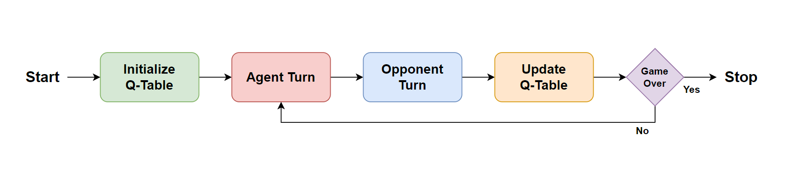

# Reinforcement Learning - TicTacToe

This repo is a simple example of the Q-Learning reinforcement learning algorithm. Specifically demonstrating how a Q-Learning agent can be used to play TicTacToe. The `src` directory contains the source files for the Q-Learning agent and environment. While the `play.py`, `train.py`, and `test.py` files can be used to interact with the Q-Learning agent and environment.

## How It Works

<div style="text-align:center">
    
</div>

In the context of TicTacToe the goal is to train the Q-Learning agent to make optimal moves, maximizing its probability to win the game. The agent does this by assigning a Q-Value to each state-action pair. Where each Q-Value represents how optimal an action is at a given state. In this case, given a state of the TicTacToe board the agent will select the action with the highest Q-Value, or in other words the optimal move. 

In order to learn optimal Q-Values the agent will iteratively learn by intelligently updating its Q-Values. The agents learning consists of two parts:

1. As the agent wins, loses, or ties games it will be provided a reward. These rewards will incentivize the agent to win and discourage it from losing or tying games.

2. The agent will update its Q-Values at each game state using the following equation ([see more](https://en.wikipedia.org/wiki/Q-learning)):

$$Q(S_{t},a_{t}) = Q(S_{t},a_{t}) + \alpha (R + \gamma \cdot Q_{max}(S_{t+1},a_{t+1}) - Q(S_{t},a_{t}))$$

## Usage

### Training

The agent can be trained by running the `train.py` file. This will train the agent and save it to the `tables/` directory. Note that there are some hyperparameters that can be tweaked in the training file.

```bash
python ./train.py
```

### Testing
The agent can be tested by running the `test.py` file. This will load the current agent that is saved in the `./tables` directory. Note there are also some parameters that can tweaked in this file.

```bash
python ./test.py
```

### Playing
You can also play the agent by running the `play.py` file. This will initiate a TicTacToe game against the agent in the terminal.

```bash
python ./play
```